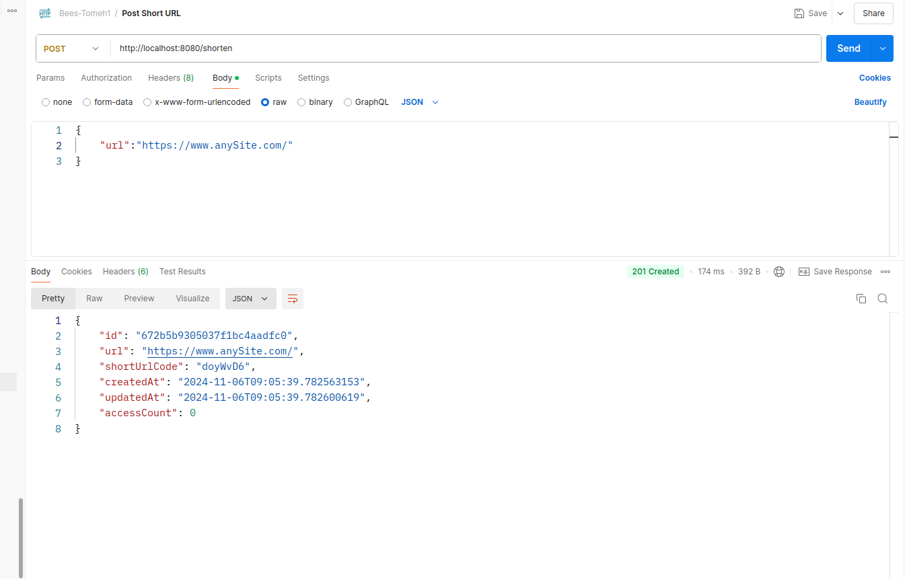
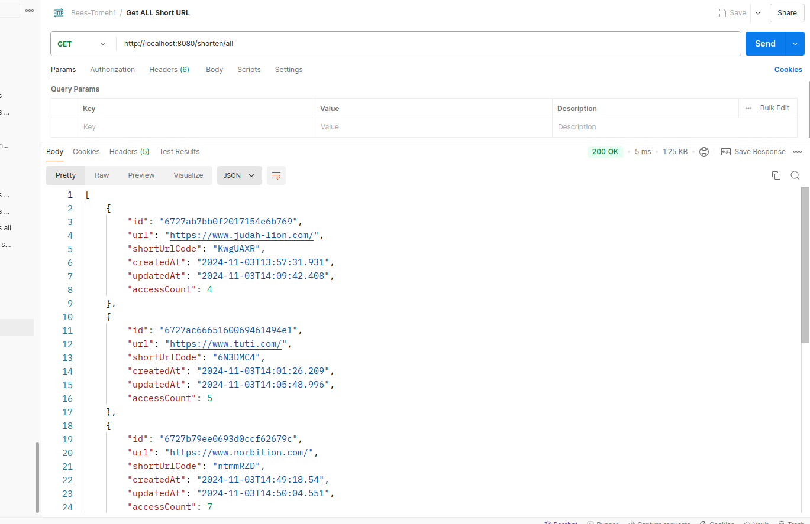
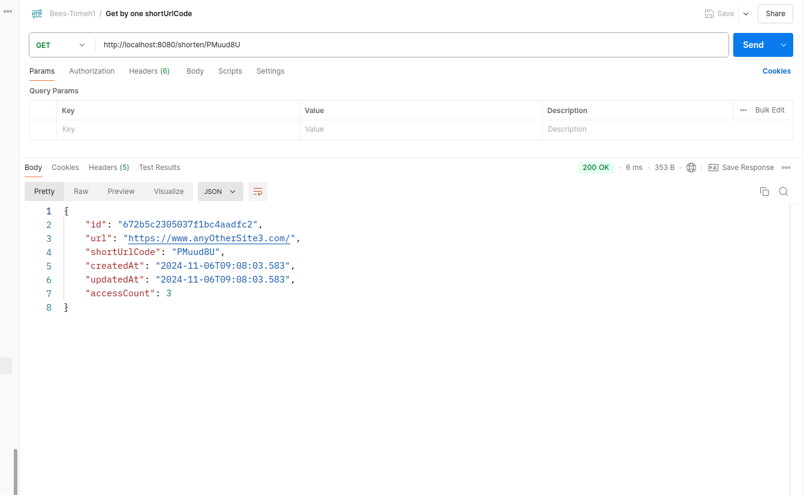
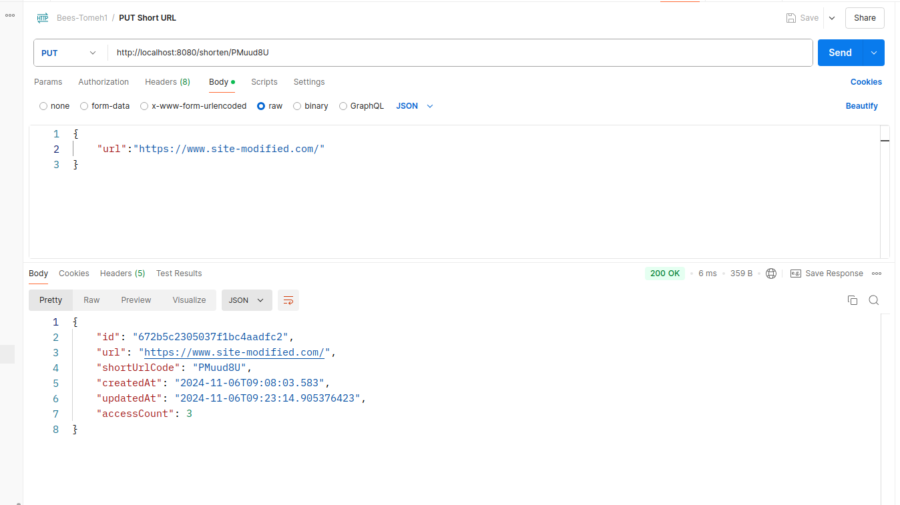
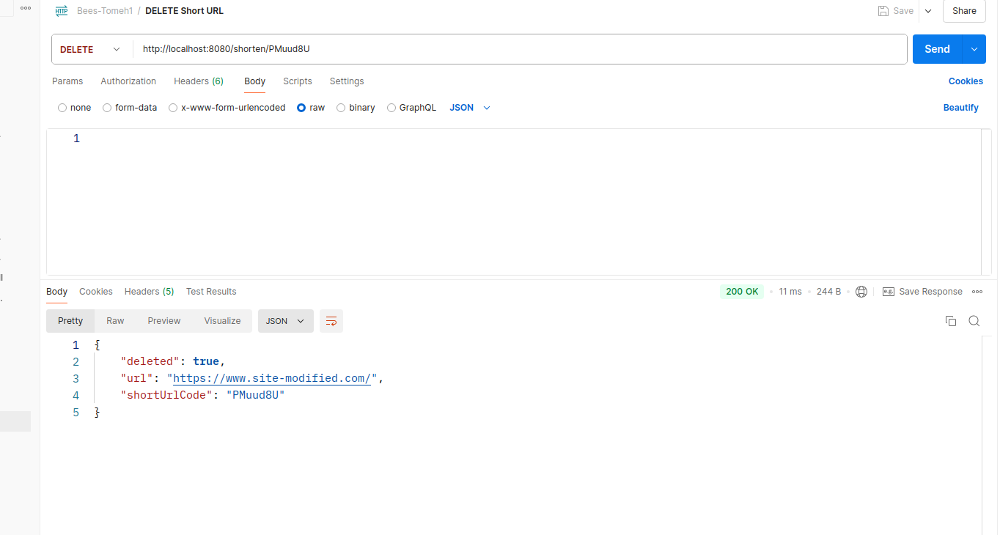

# challenge-short-url

DESAFIO MENTORIA RICCI – Convert a long URL in a reduced short URL

URL Shortening Service

url-shortening-service (https://roadmap.sh/projects/url-shortening-service)
______________________________________________________________________________

Solution Design

	Foi definido Java + Spring Boot para o backend e MongoDB como database. As principais razões para estas escolhas foi a maturidade e disponibilidade de funcionalidades robustas pelo Spring e a velocidade de pesquisa e flexibilidade de armazenagem NoSQL usando o MongoDB. A seguir o design de  alto nível para a solução:

1.  Entities:
   - `ShortUrl`: Representa a entidade de short URL com os campos `id`, `url`, `shortUrlCode`, `createdAt`, `updatedAt`, and `accessCount`.

2.  Repositories:
   - `ShortUrlRepository`: Interface que extende `MongoRepository` para aproveitar as CRUD operations já existentes e disponíveis para implementação sobre a classe `ShortUrl` , o modelo do sistema.

3.  Services:
   - `ShortUrlService`: camada de serviço uada para lidar com a lógica de negócio , com as funcionalidades CRUD (create, retrieving, updating, deleting, and getting statistics) das short URLs.

4. Controllers:
- `ShortUrlController`: classe REST Controller para manipular os endpoints de requests da API.

5. Utilities:
- `ShortCodeGenerator`: Classe utilitária pra gerar codigos de URL curtos (short_urls) que serão salvas nesse campo da entidade ‘ShortUrl ‘.  

**Exemplos das requests ao url-shorten-service:**

- POST – criando uma nova shortUrlCode

 

- GET_ALL – recuperando todos registros de ShortenUrls

 

- GET_ONE – recuperando um registro de ShortenUrls, com a respectiva estatística de acessos

 

- PUT – atualizando um registro de ShortenUrls, com alteração da url respectiva.

 

- DELETE – removendo registro de ShortenUrls

 

